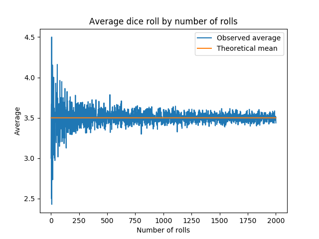

# Law of Large Numbers Demo

In probability theory, the [law of large numbers (LLN)](https://en.wikipedia.org/wiki/Law_of_large_numbers) is a theorem that describes the result of performing the same experiment a large number of times. This projects illustrates the law of large numbers using a run of rolls of a single die.

# Requirements

[Matplotlib](http://matplotlib.org) is required.

# Usage

```python
import law_of_large_numbers_demo as loln

def run():
    numRolls = 2000
    lolnDemo = loln.LawOfLargeNumbersDemo(numRolls)

    lolnDemo.run_demo()
```

The code above produces the following graph. 